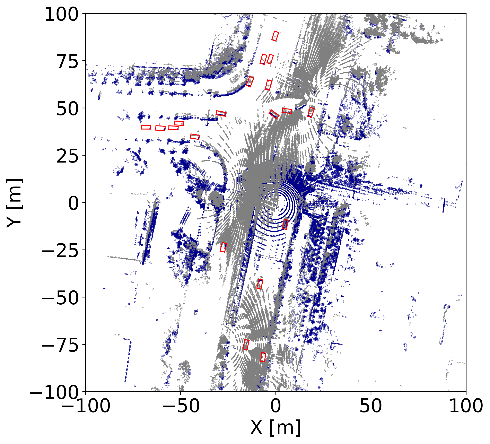
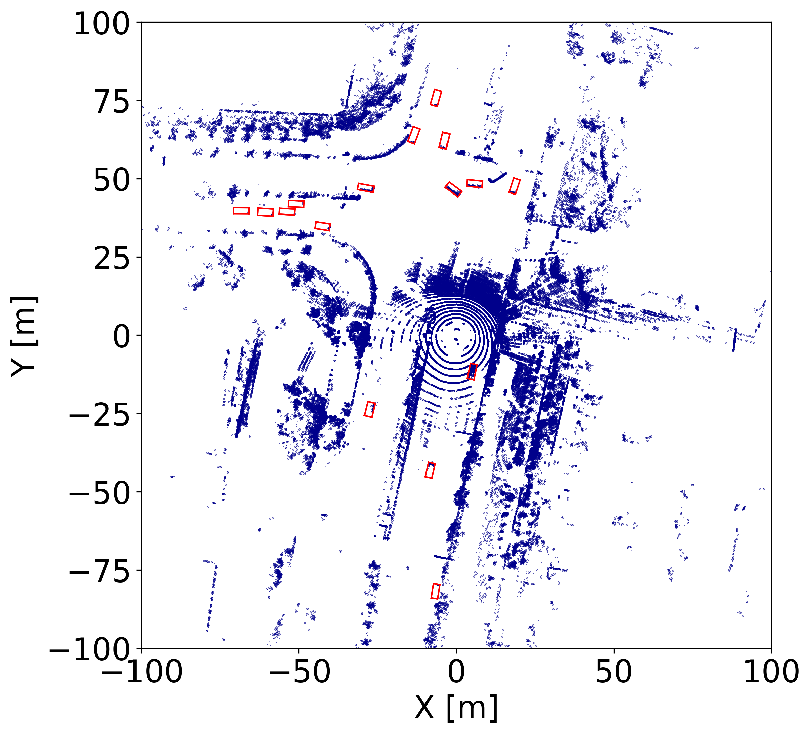

# V2XScenes
[ICCV2025] V2XScenes: A Multiple Challenging Traffic Conditions Dataset for Large-Range Vehicle-Infrastructure Collaborative Perception

This repo is a real-world **multiple challenging condition dataset** under large-range road section for **multi-modal V2X cooperative perception**.

[Paper](https://openaccess.thecvf.com/content/ICCV2025/papers/Wang_V2XScenes_A_Multiple_Challenging_Traffic_Conditions_Dataset_for_Large-Range_Vehicle-Infrastructure_ICCV_2025_paper.pdf) | [Project page](https://advrc-wangbw.github.io/V2XScenes/) 


## Data prepare

Create a `dataset` folder under `V2XScenes` and put the data there. Make the naming and structure consistent with the following:
```
dataset/v2xscenes/
├── calibration/                  # 传感器标定 | Sensor calibration 
├── data/
│   └── 20240712_111606_300_1720754373_to_1720754381_8_24/  # 场景数据目录 | Scene data directory 
│       ├── label_new/            # 标注数据 | Annotation data
│       ├── road_camera/          # 路侧相机数据 | Roadside camera data
│       ├── road_lidar/           # 路侧激光雷达数据 | Roadside LiDAR data
│       ├── veh_camera/           # 车载相机数据 | Vehicle-mounted camera data
│       ├── veh_lidar/            # 车载激光雷达数据 | Vehicle-mounted LiDAR data
│       ├── visualization/        # 可视化结果 | Visualization results
│       ├── All_Path_Maps.txt     # 路径映射文本 | Path mapping text file
│       ├── gps.pkl               # GPS 数据（pickle格式） | GPS data (pickle format)
│       ├── imu.pkl               # IMU 惯性测量数据（pickle格式） | IMU data (pickle format)
│       ├── map.pkl               # 映射数据（pickle格式） | Mapping data (pickle format)
│       ├── odom.pkl              # 里程计数据（pickle格式） | Odometry data (pickle format)
│       ├── pose.pkl              # 位姿数据（pickle格式） | Pose data (pickle format)
│       ├── Timestamp.pkl         # 时间戳数据（pickle格式） | Timestamp data (pickle format)
│       └── Timestamp.txt         # 时间戳数据（文本格式） | Timestamp data (text format)
│   └── ......
└── tools/                        # 可视化工具 | Visualization tools
```

The available sequences:

```
        # "20240712_111606_300_1720754431_to_1720754456_25_66",
        # "20240709_084703_300_1720486033_to_1720486043_10_37",
        # "20240705_200812_300_1720181335_to_1720181350_15_39",
        # "20240705_203608_300_1720183229_to_1720183240_11_32",
        # "20240706_195608_300_1720267127_to_1720267141_14_40",
        # "20240709_075541_300_1720482952_to_1720482965_13_36",
        # "20240709_075541_300_1720482986_to_1720482997_11_32",
        # "20240709_082823_300_1720485060_to_1720485089_29_97",
        # "20240709_082823_300_1720485180_to_1720485202_22_73",
        # "20240709_083937_300_1720485599_to_1720485650_51_173",
        # "20240709_172949_300_1720517416_to_1720517437_21_67",
        # "20240709_172949_300_1720517585_to_1720517608_23_65",
        # "20240711_205502_300_1720702651_to_1720702660_9_28",
        # "20240711_205502_300_1720702788_to_1720702801_13_44",
        # "20240711_211321_300_1720703639_to_1720703648_9_29",
        # "20240711_211321_300_1720703803_to_1720703820_17_51",
        # "20240712_105953_300_1720753203_to_1720753220_17_48",
        # "20240712_111606_300_1720754206_to_1720754221_15_42",
        # "20240712_111606_300_1720754254_to_1720754265_11_35",
        # "20240712_111606_300_1720754373_to_1720754381_8_24",
        ......
```

For creating a data soft link, you can refer to `create_v2x_links.py` in the tools directory.

```
python dataset/v2xscenes/tools/create_v2x_links.py --target /custom/target/path
```

## Installation
### Step 1: Basic Installation
```bash
# Create conda environment
conda env create -f environment.yml

# Activate environment
conda activate v2xscenes

# If you already have an opencood environment, directly run
python setup.py develop
```


### Step 2: Install Spconv (1.2.1 or 2.x)
We use spconv 1.2.1 or spconv 2.x to generate voxel features. spconv 2.x has much convenient installation, but our checkpoints are stored in spconv 1.2.1 and they are not compatible.

To install **spconv 2.x**, check the [table](https://github.com/traveller59/spconv#spconv-spatially-sparse-convolution-library) to run the installation command. For example we have cudatoolkit 11.6, then we should run
```bash
pip install spconv-cu116 # match your cudatoolkit version
```

To install **spconv 1.2.1**, please follow the guide in https://github.com/traveller59/spconv/tree/v1.2.1.
You can also get a detailed installation guide in [CoAlign Installation Doc](https://udtkdfu8mk.feishu.cn/docx/LlMpdu3pNoCS94xxhjMcOWIynie#doxcn5rISC6NcfXIUnWFnXhTEzd).


### Step 3: Bbx IoU cuda version compile
Install bbx nms calculation cuda version
  
```bash
python opencood/utils/setup.py build_ext --inplace
```

## Basic Train / Test Command

### Train the model
Example using the v2xsences_where2comm_all.yaml configuration file:
```
CUDA_VISIBLE_DEVICES=0 python opencood/tools/train_v2xscenes.py -y ./opencood/hypes_yaml/v2xscenes/v2xsences_where2comm.yaml
```
Visualization Debugging:
To visualize training results and verify label-data alignment, enable the plotting option:

File path: `./opencood/data_utils/datasets/intermediate_heter_fusion_dataset_v2xscenes.py`

Change `PLOT = False` to `PLOT = True` and the illustrations are shown as follows:

<table>
  <tr>
    <td></td>
    <td></td>
  </tr>
  <tr>
    <td align="center">Fusion</td>
    <td align="center">No fusion</td>
  </tr>
</table>

### Model Inference
```
CUDA_VISIBLE_DEVICES=0 python opencood/tools/train.py \
    --hypes_yaml ${CONFIG_FILE} \
    [--model_dir ${CHECKPOINT_FOLDER} \
    --half]
```

## Citation
```
@inproceedings{wang2025v2xscenes,
  title={V2XScenes: A Multiple Challenging Traffic Conditions Dataset for Large-Range Vehicle-Infrastructure Collaborative Perception},
  author={Wang, Bowen and Wang, Yafei and Gong, Wei and Chen, Siheng and Liu, Genjia and Xiong, Minhao and Ng, Chin Long},
  booktitle={Proceedings of the IEEE/CVF International Conference on Computer Vision},
  pages={28385--28395},
  year={2025}
}
```
